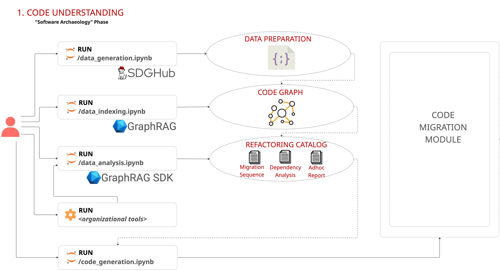

# Agent Mesh for Software Modernization

Contents
---
- [ ] [Overview](#overview)
- [ ] [Required Software / Tested with](#tested-with)
- [ ] [Installing the Code Understanding Workflow](#installing-the-code-understanding-workflow)
  - [ ] [Preparing the Environment](#preparing-the-environment)
  - [ ] [Installing via Makefile](#installing-via-makefile)
- [ ] [Running the Code Understanding Workflow](#running-the-code-understanding-workflow)
- [ ] [More About the Code Understanding Workflow](#more-about-the-code-understanding-workflow)
  - [ ] [1. Data Generation](#1-data-generation)
  - [ ] [2. Data Indexing](#2-data-indexing)
  - [ ] [3. Data Analysis](#3-data-analysis)

<a id="overview"></a>
## 🧭 Overview

[](https://drive.google.com/file/d/18FxSpwKBPPgzQnP1Q9ToPC_kLskrnni3/view)
*▶ Click to watch the demo*

This demonstrates the **Code Understanding** phase of the Agent Mesh for Software Engineering, a framework pattern 
for continuous legacy code which uses a federated, multi-harness, multi-agent 
system (MAS) to support iterative agent-driven development for brownfield applications.

(NOTE: The Agent Mesh consists of two main **workflows**: **Code 
Understanding** and **Code Migration**. This repository demonstrates the **Code Understanding** workflow.)

<a id="tested-with"></a>
## Required Software / Tested with

- Red Hat OpenShift 4.18+
- Red Hat OpenShift AI 2.22+
- 1X NVIDIA H200 GPU, 1X NVIDIA H100 GPU, 1X NVIDIA L40S GPU
- 8+ vCPUs / 24+ GiB RAM
- MLflow [Installation](https://docs.redhat.com/en/documentation/red_hat_openshift_ai_self-managed/3.4/html/working_with_mlflow/installing-mlflow_mlflow)
- Openshift AI Model Registry [Installation](https://docs.redhat.com/en/documentation/red_hat_openshift_ai_self-managed/2.25/html-single/enabling_the_model_registry_component/index)
- Openshift AI Model Catalog [Installation](https://docs.redhat.com/en/documentation/red_hat_openshift_ai_self-managed/3.4/html-single/working_with_the_model_catalog/index)
- Openshift AI Pipelines [Installation](https://docs.redhat.com/en/documentation/red_hat_openshift_ai_self-managed/3.5/html/openshift_ai_tutorial_-_fraud_detection_example/setting-up-a-project-and-storage#enabling-ai-pipelines)
- OpenShift CLI (`oc`)
- Helm CLI (`helm`)

## Installing the Code Understanding Workflow

### Preparing the Environment

1. Create an environment variables file `.env` using `workflows/.env-template` as a guide.

### Installing via Makefile
1. Run the Makefile: `make install`

## Running the Code Understanding Workflow
1. To run the **Code Understanding** pipeline for a single repository, run:
```make run-pipelines ARGS="--single"```

2. To run the **Code Understanding** pipeline for multiple repositories, 
   perform the following steps:
    - Update `assets/repos/repo_list.json` with the list of repositories to 
      be processed.
    - Run the following command:
   ```make run-pipelines ARGS="--aggregated"```

## More About the Code Understanding Workflow



The **Code Understanding** workflow is the initial **iteration** in the 
process. It is a **tool-driven workflow** which generates artifacts for the 
**refactoring catalog**. These artifacts are optionally combined with 
other tools (organizational vulnerability scanners, static rules engines, 
etc) to build the **migration plan** for the **Code Migration** workflow.

There are three main sub-workflows in the **Code Understanding** workflow:

#### 1. Data Generation

The **Data Generation** sub-workflow is used to generate metadata that will be 
used for GraphRAG-based indexing. For each relevant file in the original 
codebase, it will generate a `.txt` version of the file and a new metadata 
file. This enriched fileset will then be passed as input to the **Data Indexing** workbench in the next step.

#### 2. Data Indexing

The **Data Indexing** sub-workflow is used to index the fileset from the 
**Data Generation** step using GraphRAG. It will generate a graph-based 
representation of the codebase that can be used for querying.

#### 3. Data Analysis

The **Data Analysis** workbench is used to query the generated GraphRAG index using the GraphRAG SDK.
It includes both canned and adhoc queries that can be used to explore the 
code and generate assets for the refactoring catalog, including a migration plan.


